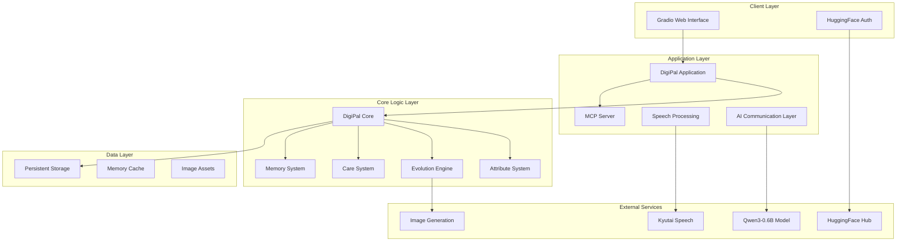

# Design Document

## Overview

DigiPal is a sophisticated digital pet application that combines modern AI technologies with classic virtual pet mechanics. The system serves dual purposes: providing an engaging Gradio web interface for users to interact with their digital companions, and functioning as an MCP server for integration with other AI systems. The architecture leverages Qwen3-0.6B for natural language processing, Kyutai for speech recognition, and implements a comprehensive attribute system inspired by Digimon World 1.

## Architecture

### High-Level Architecture



### Technology Stack

- **Frontend**: Gradio for web interface with custom CSS for game-style UI
- **Backend**: Python with asyncio for concurrent operations
- **AI Models**: 
  - Qwen3-0.6B for natural language communication
  - Kyutai for speech-to-text processing
  - Stable Diffusion or similar for 2D image generation
- **Storage**: SQLite for persistence with JSON for complex data structures
- **MCP Integration**: Python MCP SDK for server implementation
- **Authentication**: HuggingFace Hub API for user authentication

## Components and Interfaces

### 1. Gradio Interface Layer

**Purpose**: Provides the user-facing web interface with game-style aesthetics

**Key Components**:
- `AuthenticationTab`: Handles HuggingFace login with custom styling
- `DigiPalMainInterface`: Main interaction area with pet display and controls
- `EggSelectionInterface`: New user egg selection with visual previews
- `CareActionsPanel`: Training, feeding, and care action controls
- `StatusDisplay`: Real-time attribute and status visualization

**Interface**:
```python
class GradioInterface:
    def __init__(self, digipal_core: DigiPalCore)
    def launch_interface(self) -> None
    def handle_authentication(self, token: str) -> bool
    def display_egg_selection(self) -> str  # Returns selected egg color
    def update_pet_display(self, pet_state: PetState) -> None
    def handle_speech_input(self, audio: bytes) -> str
```

### 2. DigiPal Core Engine

**Purpose**: Central orchestrator managing pet lifecycle, attributes, and interactions

**Key Components**:
- `PetManager`: Handles pet creation, loading, and lifecycle management
- `AttributeEngine`: Implements Digimon World 1 attribute mechanics
- `EvolutionController`: Manages life stage transitions and evolution logic
- `InteractionProcessor`: Processes user commands and generates responses

**Interface**:
```python
class DigiPalCore:
    def __init__(self, storage: StorageManager, ai_comm: AICommunication)
    def create_new_pet(self, egg_type: EggType, user_id: str) -> DigiPal
    def load_existing_pet(self, user_id: str) -> Optional[DigiPal]
    def process_interaction(self, command: str, pet: DigiPal) -> InteractionResult
    def update_pet_state(self, pet: DigiPal, time_delta: float) -> None
    def trigger_evolution(self, pet: DigiPal) -> EvolutionResult
```

### 3. AI Communication Layer

**Purpose**: Handles speech processing and natural language generation

**Key Components**:
- `SpeechProcessor`: Integrates with Kyutai for speech-to-text
- `LanguageModel`: Manages Qwen3-0.6B for response generation
- `CommandInterpreter`: Parses user input into actionable commands
- `ResponseGenerator`: Creates contextual responses based on pet state

**Interface**:
```python
class AICommunication:
    def __init__(self, model_path: str, kyutai_config: dict)
    def process_speech(self, audio_data: bytes) -> str
    def generate_response(self, input_text: str, pet_context: PetContext) -> str
    def interpret_command(self, text: str, pet_stage: LifeStage) -> Command
    def update_conversation_memory(self, interaction: Interaction) -> None
```

### 4. MCP Server Integration

**Purpose**: Provides MCP protocol compliance for external system integration

**Key Components**:
- `MCPServerHandler`: Implements MCP protocol endpoints
- `ToolRegistry`: Registers DigiPal interaction tools for MCP clients
- `StateExporter`: Provides read-only access to pet state for external systems
- `CommandBridge`: Allows external systems to trigger pet interactions

**Interface**:
```python
class MCPServer:
    def __init__(self, digipal_core: DigiPalCore)
    def register_tools(self) -> List[Tool]
    def handle_tool_call(self, tool_name: str, arguments: dict) -> ToolResult
    def get_pet_status(self, user_id: str) -> dict
    def execute_care_action(self, user_id: str, action: CareAction) -> ActionResult
```

### 5. Storage and Persistence

**Purpose**: Manages data persistence and caching for optimal performance

**Key Components**:
- `DatabaseManager`: SQLite operations for structured data
- `FileStorage`: Handles image assets and large binary data
- `CacheManager`: In-memory caching for frequently accessed data
- `BackupSystem`: Automated backup and recovery mechanisms

**Interface**:
```python
class StorageManager:
    def __init__(self, db_path: str, assets_path: str)
    def save_pet(self, pet: DigiPal) -> bool
    def load_pet(self, user_id: str) -> Optional[DigiPal]
    def save_interaction_history(self, interactions: List[Interaction]) -> bool
    def get_user_assets(self, user_id: str) -> List[AssetReference]
```

## Data Models

### Core Pet Model

```python
@dataclass
class DigiPal:
    id: str
    user_id: str
    name: str
    egg_type: EggType
    life_stage: LifeStage
    generation: int
    
    # Primary Attributes (Digimon World 1 inspired)
    hp: int
    mp: int
    offense: int
    defense: int
    speed: int
    brains: int
    
    # Secondary Attributes
    discipline: int
    happiness: int
    weight: int
    care_mistakes: int
    energy: int
    
    # Lifecycle Management
    birth_time: datetime
    last_interaction: datetime
    evolution_timer: float
    
    # Memory and Context
    conversation_history: List[Interaction]
    learned_commands: Set[str]
    personality_traits: Dict[str, float]
    
    # Visual Representation
    current_image_path: str
    image_generation_prompt: str
```

### Attribute System

```python
class AttributeModifier:
    attribute: str
    change: int
    conditions: List[str]

class CareAction:
    name: str
    energy_cost: int
    happiness_change: int
    attribute_modifiers: List[AttributeModifier]
    success_conditions: List[str]
    failure_effects: List[AttributeModifier]

class EvolutionRequirement:
    min_attributes: Dict[str, int]
    max_care_mistakes: int
    min_age_hours: float
    required_actions: List[str]
```

### Interaction System

```python
@dataclass
class Interaction:
    timestamp: datetime
    user_input: str
    interpreted_command: str
    pet_response: str
    attribute_changes: Dict[str, int]
    success: bool

@dataclass
class Command:
    action: str
    parameters: Dict[str, Any]
    stage_appropriate: bool
    energy_required: int
```

## Error Handling

### Speech Processing Errors
- **Audio Quality Issues**: Implement noise reduction and audio validation
- **Recognition Failures**: Provide fallback text input option
- **Language Model Errors**: Graceful degradation with pre-defined responses

### Pet State Errors
- **Attribute Overflow**: Implement bounds checking with configurable limits
- **Evolution Failures**: Rollback mechanisms for failed evolution attempts
- **Save/Load Errors**: Automatic backup restoration and data validation

### MCP Integration Errors
- **Protocol Violations**: Comprehensive error responses following MCP standards
- **Tool Execution Failures**: Isolated error handling preventing system crashes
- **Authentication Issues**: Secure error messages without exposing sensitive data

### Network and External Service Errors
- **HuggingFace API Failures**: Offline mode with cached authentication
- **Model Loading Errors**: Progressive fallback to simpler models
- **Image Generation Failures**: Default image assets with retry mechanisms

## Testing Strategy

### Unit Testing
- **Attribute System**: Comprehensive tests for all attribute calculations and modifications
- **Evolution Logic**: Test all evolution paths and edge cases
- **Command Processing**: Validate command interpretation across all life stages
- **Storage Operations**: Test data persistence and retrieval accuracy

### Integration Testing
- **AI Model Integration**: Test speech processing and response generation pipelines
- **MCP Protocol Compliance**: Validate all MCP endpoints and tool registrations
- **Gradio Interface**: Test UI interactions and state synchronization
- **Authentication Flow**: End-to-end authentication and session management

### Performance Testing
- **Memory Usage**: Monitor memory consumption during extended interactions
- **Response Times**: Ensure sub-second response times for user interactions
- **Concurrent Users**: Test multiple simultaneous pet instances
- **Model Loading**: Optimize cold start times for AI models

### User Experience Testing
- **Pet Lifecycle**: Complete lifecycle testing from egg to elderly
- **Care Mechanics**: Validate all care actions produce expected results
- **Evolution Paths**: Test all possible evolution outcomes
- **Generational Inheritance**: Verify DNA passing and attribute inheritance

### Security Testing
- **Authentication Security**: Test token validation and session management
- **Input Validation**: Prevent injection attacks through speech and text input
- **Data Privacy**: Ensure user data isolation and secure storage
- **MCP Security**: Validate tool access controls and permission systems

## Performance Considerations

### Model Optimization
- **Quantized Models**: Use 4-bit or 8-bit quantization for Qwen3-0.6B to reduce memory usage
- **Model Caching**: Keep models loaded in memory for faster response times
- **Batch Processing**: Group similar operations for improved efficiency

### Storage Optimization
- **Database Indexing**: Optimize queries with appropriate indexes on user_id and timestamps
- **Asset Compression**: Compress generated images without quality loss
- **Cache Strategy**: Implement LRU cache for frequently accessed pet data

### Real-time Responsiveness
- **Asynchronous Processing**: Use asyncio for non-blocking operations
- **Background Tasks**: Handle evolution checks and attribute decay in background
- **Progressive Loading**: Load UI components progressively for better perceived performance

## Deployment Architecture

### Development Environment
- **Local Development**: Docker containers for consistent development environment
- **Model Management**: Local model storage with version control
- **Database Setup**: SQLite for development with migration scripts

### Production Deployment
- **Container Orchestration**: Docker containers with health checks
- **Model Serving**: Dedicated model serving infrastructure
- **Database**: PostgreSQL for production with connection pooling
- **Monitoring**: Comprehensive logging and metrics collection

### Scalability Considerations
- **Horizontal Scaling**: Stateless design enabling multiple instance deployment
- **Load Balancing**: Session-aware load balancing for user continuity
- **Resource Management**: Dynamic resource allocation based on user load